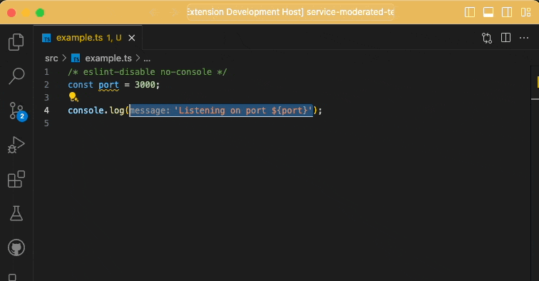

# Overwrap

An extension to overwrite the wrapping symbols of selected text. Has your selected text got double quotes but you need backticks? Overwrap can help.

## Features

Allows you to highlight some text and overwrite the wrapping symbols.

For example, you could highlight the following text which uses double quotes:

```js
"Hello from the ${otherside}";
```

And toggle it to use backticks

```js
`Hello from the ${otherside}`;
```



The extension provides commands to overwrite using the following wrapping symbols:

- double quotes `"stuff"`
- single quotes `(stuff)`
- square brackets `[stuff]`
- curly braces `{stuff}`
- parens `` `stuff` ``

## Extension Settings

This extension contributes the following settings:

- `overwrap.trimWhitespace`: Trim whitespace from the selected text before applying the changes.

## Release Notes

### 1.0.0

Initial release of the extension

### 1.0.1

Added an icon
